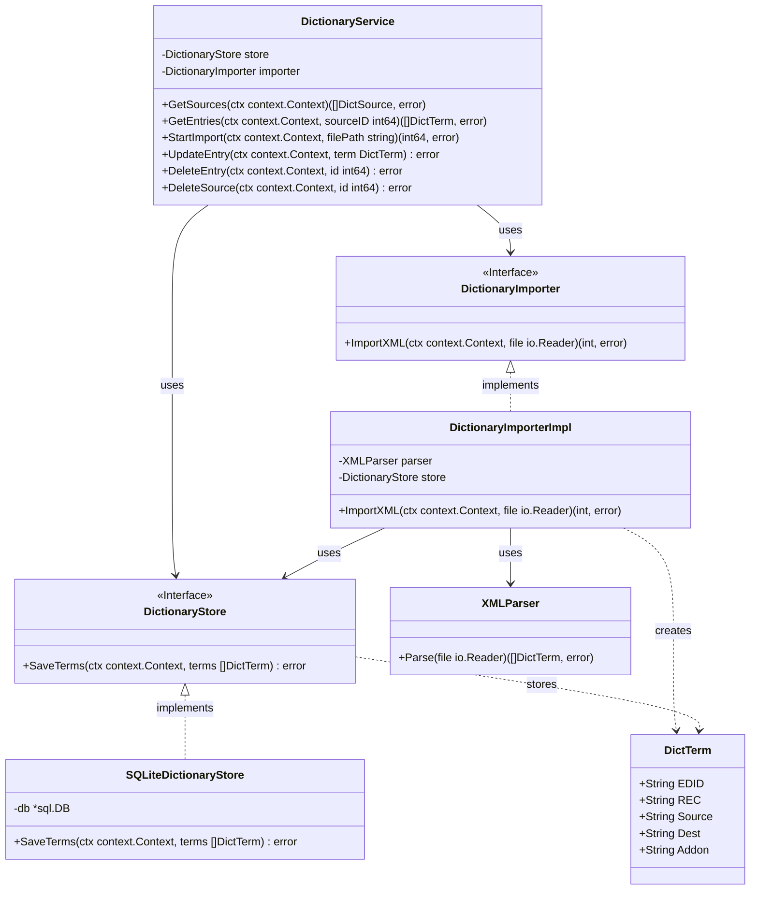

# 辞書DB作成 クラス図

## アーキテクチャの補足：基本インフラの注入による純粋な Vertical Slicing
本コンテキスト（Dictionary Slice）は、**「XMLパース」から「DBテーブルスキーマ(DTO)定義」「SQL永続化」までの全責務をこのスライス単体で負う**。
AIDDにおいてAIが変更範囲を迷わず限定・自己完結させて決定的にコードを生成できるよう、あえて全体での「DRY」は捨て、他のコンテキスト（例：翻訳時の辞書読み込み等）とはStoreやモデルを共有しない。
外部（プロセスマネージャー等）からは、DBのプーリングや接続管理のためだけのインフラモジュール（例：`*sql.DB` コネクションプール）のみをDIで注入する形とする。

## 推奨ライブラリ (Go Backend)
*   **XML 解析**: `encoding/xml` (標準ライブラリ)
*   **DB アクセス**: `github.com/mattn/go-sqlite3` (デファクトスタンダード、ただしCGO有効化が必要) または `modernc.org/sqlite` (CGO不要な代替品)
*   **依存性注入**: `github.com/google/wire` (プロジェクト標準)
*   **通信方式**: Wails バインディング (フロントエンドとの直接通信)
