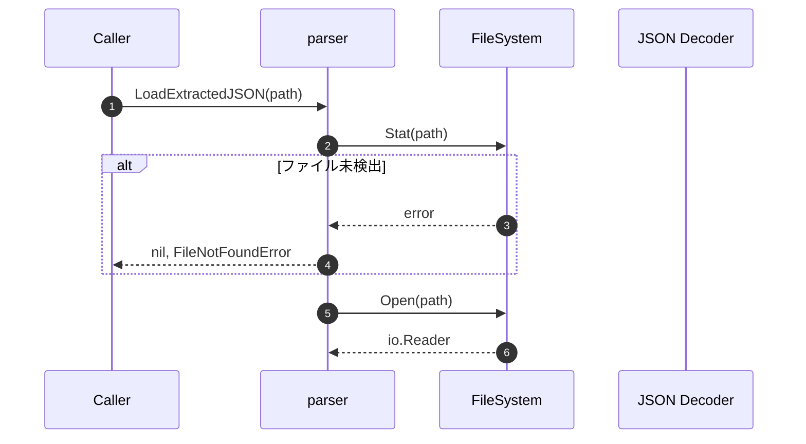
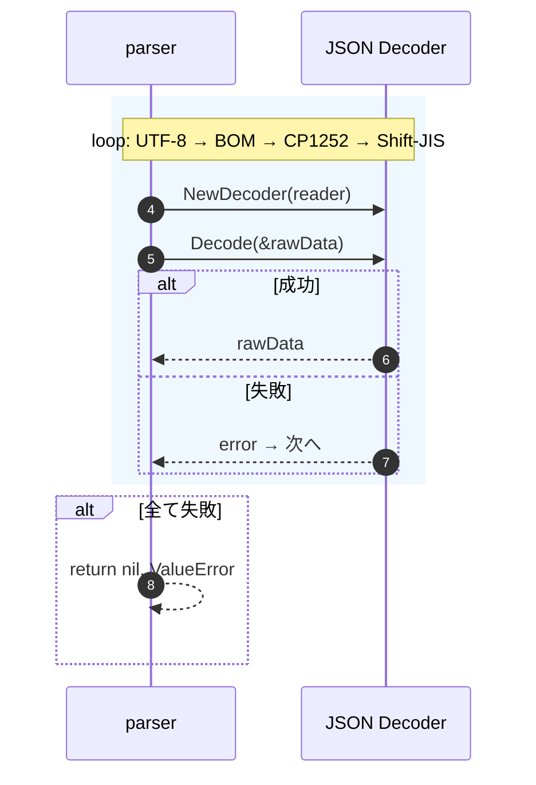
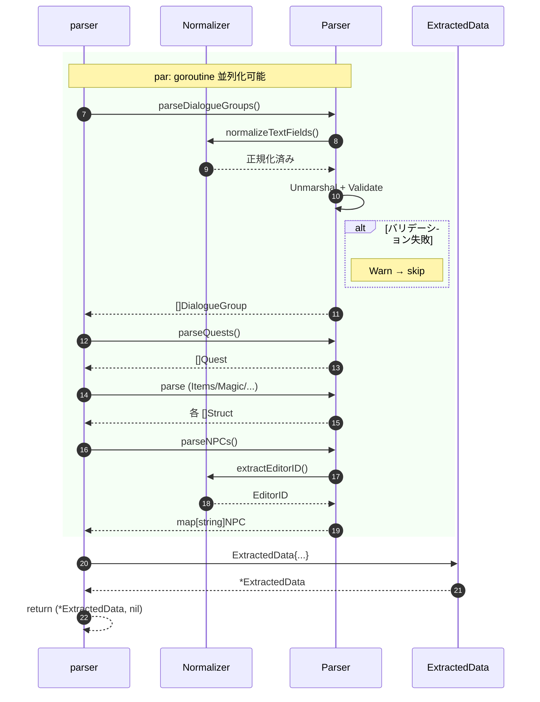

# データローダー シーケンス図

> ファイル読み込み → バリデーション → メモリストア格納
> Interface-First: Parser は Translatable Contract のみに依存

---

## 1. メインフロー

---

## 2. エンコーディング試行

---

## 3. カテゴリ別パース

---

## エラーハンドリング方針

| エラー              | タイミング     | 対処        |
| ------------------- | -------------- | ----------- |
| FileNotFound        | ファイル確認   | 即 return   |
| JSONDecode          | エンコード試行 | 次を再試行  |
| Validation (個別)   | パース中       | Warn & skip |
| Validation (ルート) | 構築時         | 即 return   |

---

## Go 移行ポイント

| 項目       | Python → Go                             |
| ---------- | --------------------------------------- |
| JSON       | `json.load()` → `encoding/json` Decoder |
| 検証       | Pydantic → custom Unmarshal             |
| 文字コード | latin-1 fallback → `x/text/encoding`    |
| 並列化     | なし → goroutine + WaitGroup            |
| エラー     | try/except → error + continue           |
