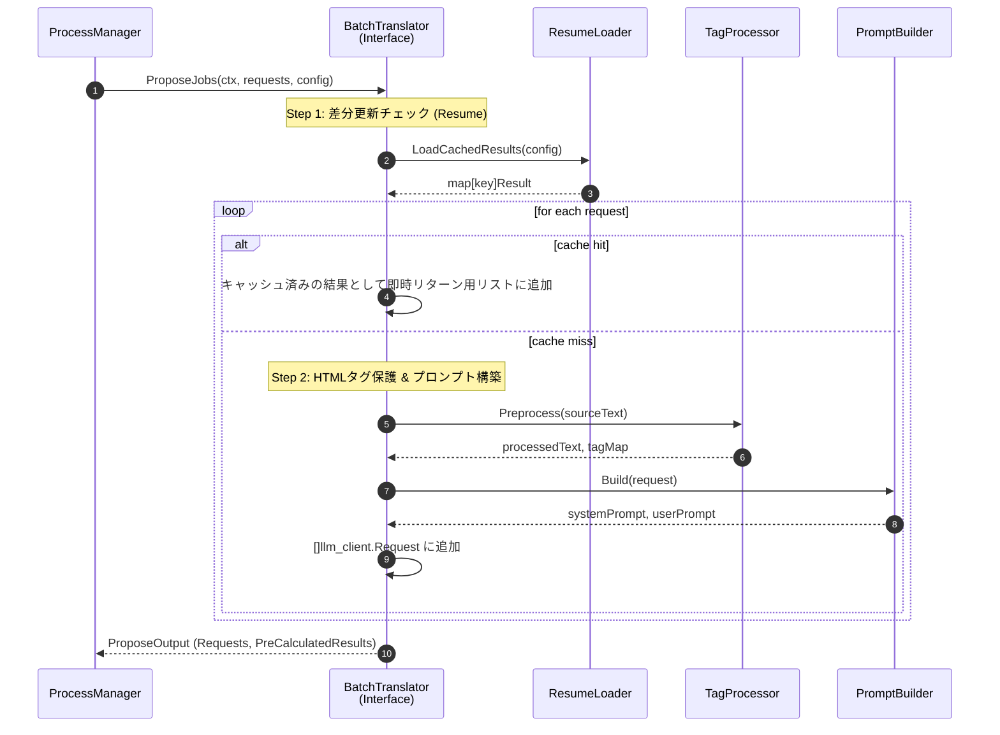
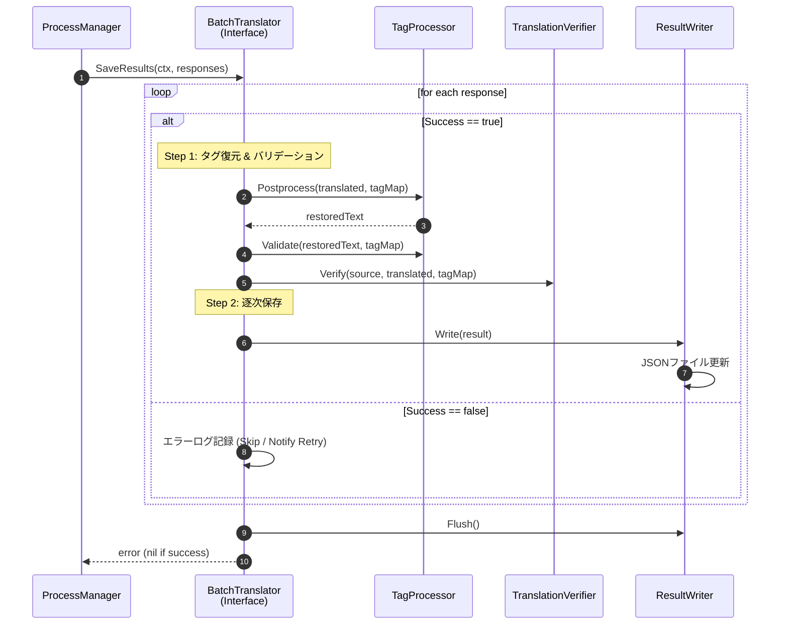
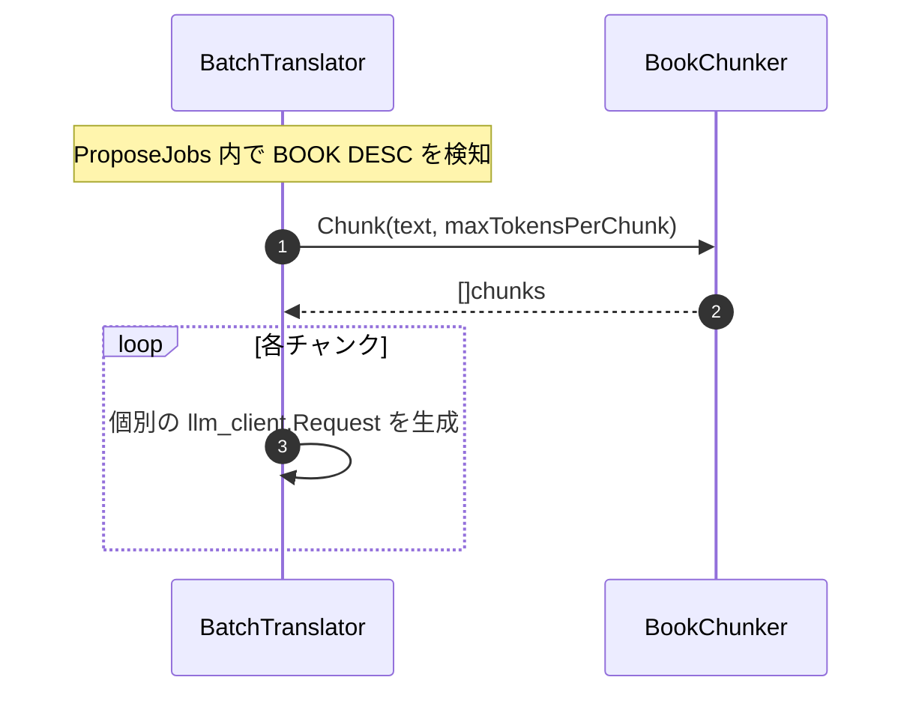

# 本文翻訳 シーケンス図

## 1. 本文翻訳メインフロー（2フェーズモデル）

2フェーズモデルでは、スライスは「ジョブ提案 (Phase 1)」と「結果保存 (Phase 2)」の2つの独立した Contract メソッドとして呼び出される。

### Phase 1: 翻訳ジョブの提案 (Propose)

### Phase 2: 翻訳結果の保存 (Save)

## 2. 書籍長文分割翻訳フロー（Propose時）

