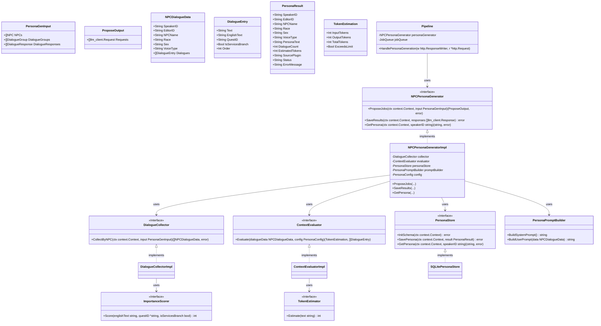

# NPCペルソナ生成 クラス図

## アーキテクチャの補足：2フェーズモデル (Propose/Save)
本スライスはバッチAPIや長時間実行ジョブに対応するため、**「プロンプト生成(ProposeJobs)」**と**「結果保存(SaveResults)」**の2フェーズに分割されている。
- **Phase 1 (Propose)**: 入力データを解析し、NPCごとに会話データの収集・選別、コンテキスト長評価を行い、LLMリクエスト群を生成する。
- **Phase 2 (Save)**: JobQueue等を通じて取得されたLLMのレスポンス群を受け取り、パースしてペルソナDBに永続化する。

スライス自身はLLM Clientを直接呼び出さず、通信制御はオーケストレーターに委譲される。
