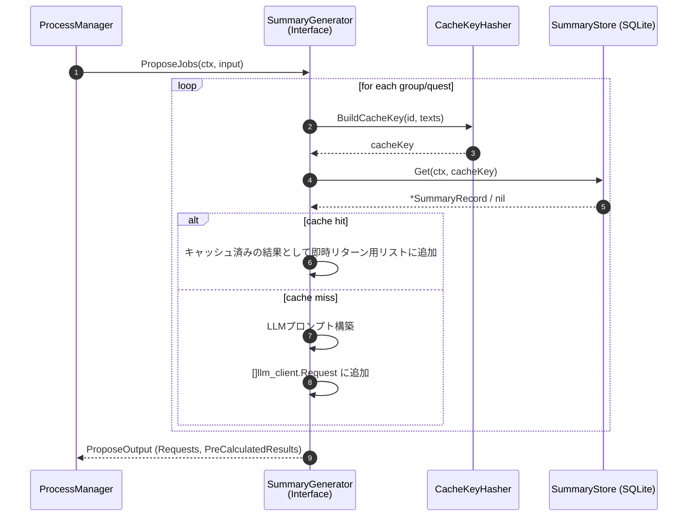
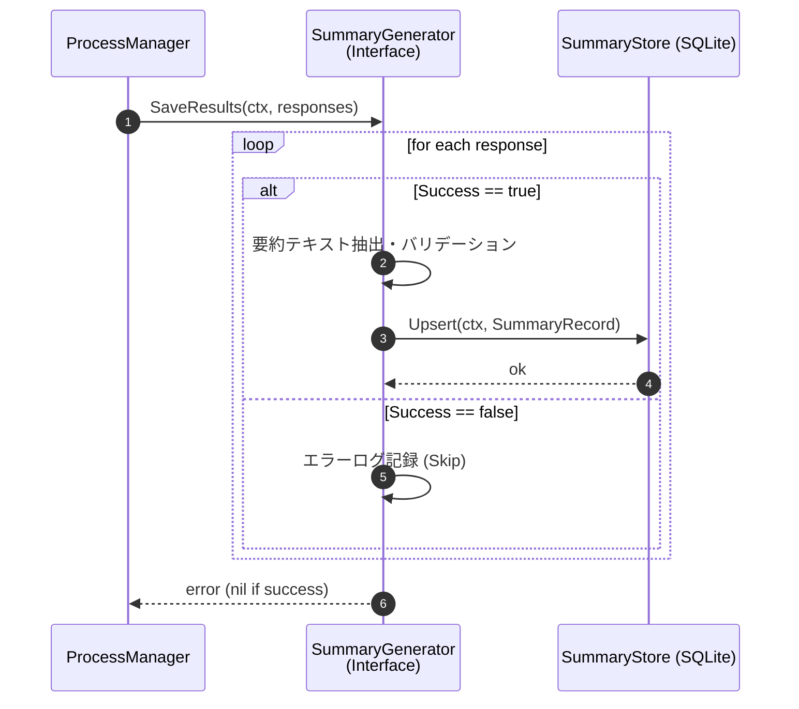
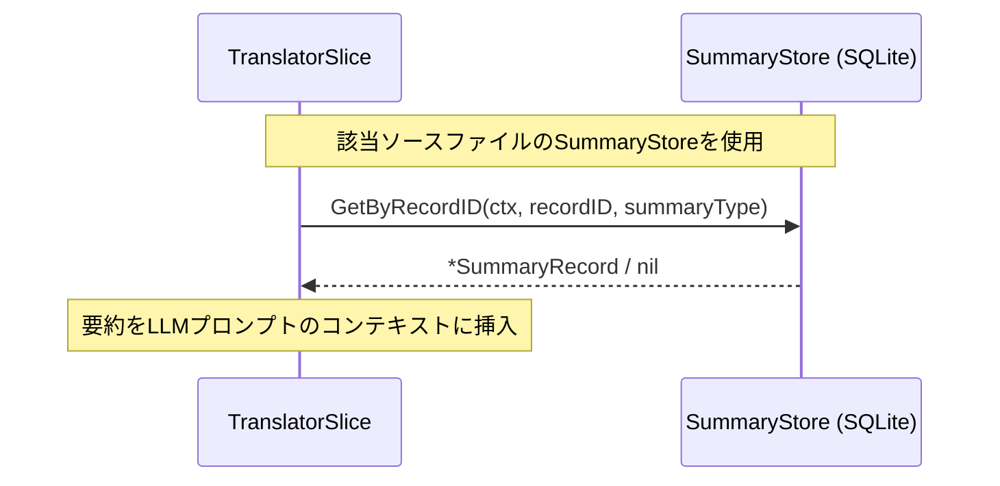

# 要約ジェネレータ シーケンス図

## 1. 要約生成フロー（2フェーズモデル）

2フェーズモデルでは、スライスは「ジョブ提案 (Phase 1)」と「結果保存 (Phase 2)」の2つの独立した Contract メソッドとして呼び出される。

### Phase 1: 要約ジョブの提案 (Propose)

### Phase 2: 要約結果の保存 (Save)

## 2. Pass 2 参照フロー

