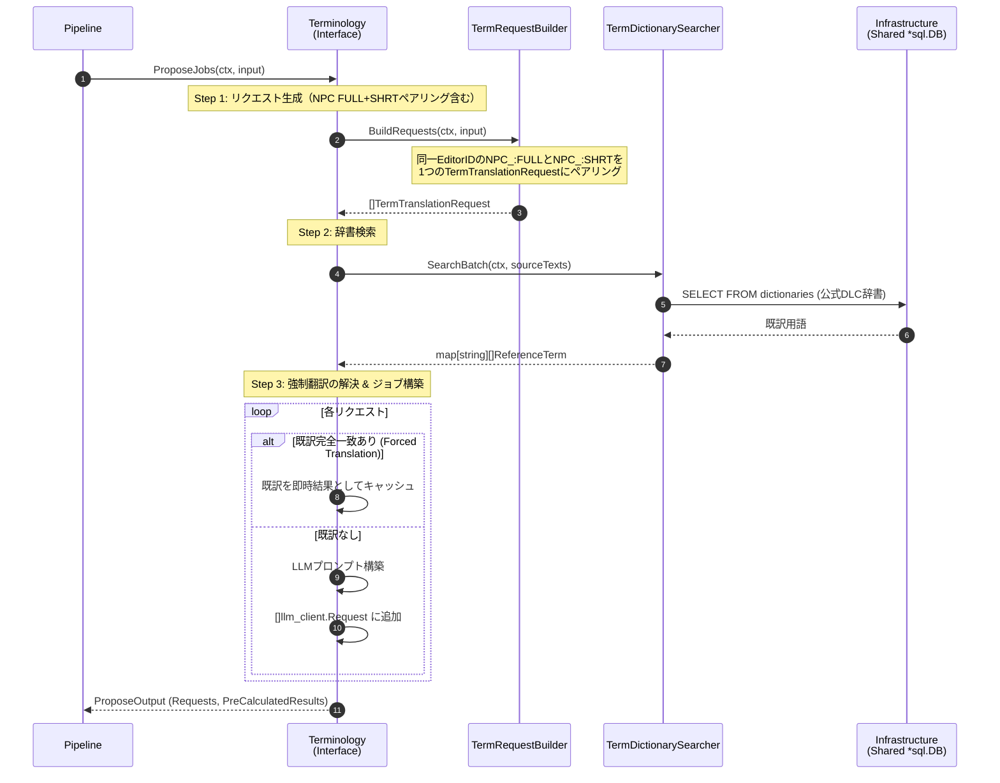
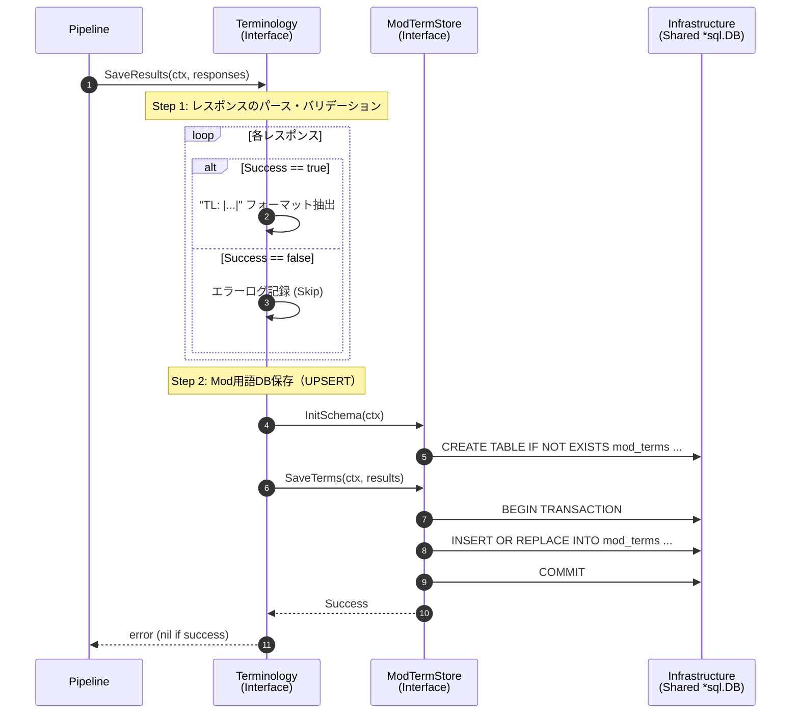
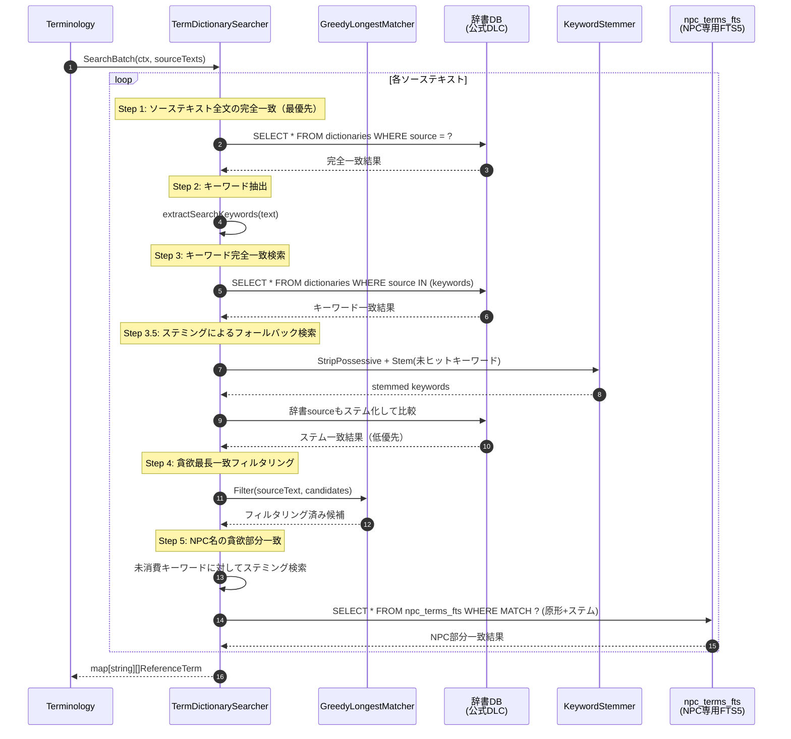

# 用語翻訳・Mod用語DB保存 シーケンス図

## 1. 用語翻訳メインフロー（2フェーズモデル）

2フェーズモデルでは、スライスは「ジョブ提案 (Phase 1)」と「結果保存 (Phase 2)」の2つの独立した Contract メソッドとして呼び出される。LLMとの通信は外部（Pipeline / JobQueue）が担当する。

### Phase 1: 用語翻訳ジョブの提案 (Propose)

### Phase 2: 用語翻訳結果の保存 (Save)

## 2. 辞書検索の詳細フロー（貪欲部分一致）

