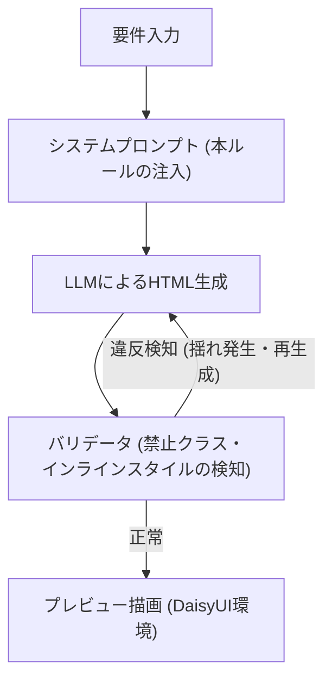

# AI駆動ワイヤーフレーム UI生成ルール仕様書

## 1. 概要と戦略
本仕様は、AIによるHTMLワイヤーフレーム生成において、デザインの「揺れ（ハルシネーションや文脈喪失による非決定的な出力）」を極限まで排除するための戦略を定義する。

**基本方針：スタイリング（装飾）とレイアウト（骨格）の責務分離**
AIにはデザインの決定権を与えず、「意味的なコンポーネントの配置」のみを許可する。
- **装飾**: DaisyUIのコンポーネントクラスに完全依存する。
- **レイアウト**: 許可されたTailwind CSSのレイアウト用ユーティリティクラスのみを使用する。

## 2. 生成とバリデーションのフロー
AIの出力結果をそのまま信頼せず、システム的に禁止クラスを弾く機構を前提とする。

## 3. クラス使用制約リスト
AIに対するプロンプト、およびバリデータのルールエンジンとして適用するリスト。

### 3.1 🟢 許可リスト1: コンポーネント（装飾と意味）
UIの「見た目」と「意味」は、必ず以下のDaisyUIクラス群を使用して構成すること。AI自身による色や形などのデザイン調整は一切認めない。

- **構造・シェル**: `navbar`, `footer`, `drawer`, `hero`, `artboard`
- **コンテナ・データ**: `card`, `card-body`, `card-actions`, `table`, `carousel`, `accordion`, `stat`
- **アクション・ナビ**: `btn`, `menu`, `tabs`, `tab`, `breadcrumbs`, `pagination`
- **フィードバック・状態**: `alert`, `toast`, `modal`, `badge`, `progress`, `skeleton`
- **公式モディファイア**: `btn-primary`, `btn-ghost`, `alert-error`, `card-compact`, `tab-active` 等

### 3.2 🟢 許可リスト2: レイアウト（骨格と配置）
要素の配置や骨格を構築するため、以下のTailwind CSSユーティリティクラスに限り使用を許可する。

- **配置 (Flex/Grid)**: `flex`, `flex-col`, `justify-between`, `items-center`, `grid`, `grid-cols-1`, `grid-cols-2` 等
- **寸法 (Sizing)**: `w-full`, `max-w-md`, `h-screen` 等
- **余白 (Spacing)**: `p-4`, `m-4`, `gap-4` (※値の揺れを防ぐため、原則として 4 または 8 のスケールのみを推奨)

### 3.3 🔴 絶対禁止リスト（揺れ・ハルシネーションの排除）
以下の記述が含まれていた場合、出力は無効（パースエラー）として扱う。

- **装飾用Tailwindクラス**: `bg-blue-500`, `text-red-400`, `rounded-xl`, `shadow-lg` など。（テーマ一元管理に反するため）
- **インラインスタイル**: `style="..."` 属性はいかなる理由があっても使用不可。
- **未定義・他フレームワークのクラス**: 許可リスト以外の独自のクラス名（例: `custom-header`）や、他フレームワーク由来のクラス（例: `row`, `container-fluid`, `v-card`）。
