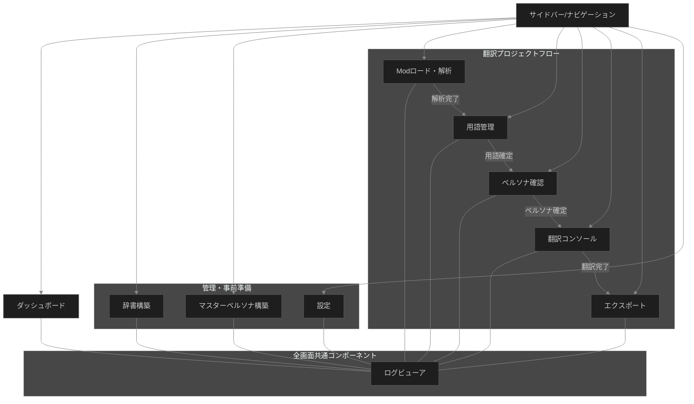

# UI画面一覧 (UI Screen List)

Skyrim Mod Translation Engine (v2.0) のReactフロントエンドにおける画面一覧と、それぞれの主要機能および対応するスライスの定義です。

## 1. 画面一覧

| 画面名 | 主な機能 | 関連スライス/インフラ |
| :--- | :--- | :--- |
| **ダッシュボード (Dashboard)** | プロジェクト全体の進捗確認、最近のジョブ、クイックスタート | `pipeline`, `progress` |
| **辞書構築 (Dictionary Builder)** | xTranslator形式XMLのインポート、システム共通辞書 (`dictionary.db`) の作成 | `dictionary`, `progress` |
| **マスターペルソナ構築 (Master Persona Builder)** | Skyrim.esm 等のマスターファイルからNPCペルソナを一括生成・キャッシュ | `persona`, `progress` |
| **Modロード・解析 (Mod Loader)** | xEdit抽出データのアップロード/選択、構造解析の実行 | `parser`, `pipeline`, `progress` |
| **用語管理 (Terminology Manager)** | 抽出されたMod固有用語の確認、手動翻訳修正、辞書からの適用 | `terminology` |
| **ペルソナ確認 (Persona Viewer)** | 生成されたNPCペルソナ（性格・口調）の確認と編集 | `persona` |
| **翻訳プレビュー・実行 (Translation Console)** | プロンプトの最終確認、翻訳パスの実行、リアルタイム結果表示 | `translator`, `summary`, `progress` |
| **エクスポート (Exporter)** | xTranslator互換XML等の出力設定とダウンロード | `export` |
| **設定 (Settings)** | LLMプロバイダ設定（APIキー等）、共通プロンプトテンプレート編集 | `config`, `llm` |
| **ログビューア (Log Viewer)** | **【全画面共通】** システムの実行ログ (Structured Logs) のリアルタイム表示 | `telemetry` (OpenTelemetry + slog) |

---

## 2. 画面遷移図

---

## 3. 各画面の詳細補足

### ダッシュボード (Dashboard)
- 処理中のMod一覧と、それぞれのフェーズ（解析中/翻訳中/完了）を可視化。
- `progress` スライスからSSE/WebSocketでリアルタイムに進捗を受け取る。

### 辞書構築 (Dictionary Builder)
- **事前準備**: 公式DLCや既存の高品質な翻訳XML（SSTXML）を読み込み、`dictionary.db` に格納する。
- 翻訳プロジェクト開始前に準備しておく「システム辞書」の管理画面。

### マスターペルソナ構築 (Master Persona Builder)
- **事前準備**: `Skyrim.esm` や `Dawnguard.esm` 等のベースゲームデータからNPC情報を解析し、LLMを用いてペルソナ（性格・口調）を生成、キャッシュする。
- 翻訳プロジェクト実行時に、バニラのNPCが登場した場合にここから口調情報を引き出す。

### Modロード・解析 (Mod Loader)
- `extractData.pas` で出力されたJSONファイルをドラッグ＆ドロップで受け付ける。
- 解析実行ボタンにより `parser` スライスをキックする。

### 用語管理 (Terminology Manager)
- `terminology.db`（Mod固有用語）の内容をグリッド表示。
- 構築済みの「システム辞書」からの一致検索と一括適用機能。

### 翻訳プレビュー・実行 (Translation Console)
- **重要**: `architecture.md` セクション 5. LLM統合の原則に基づき、ここからLLMプロバイダ（Gemini, Local等）を選択可能にする。
- プロンプトの最終調整。

### ログビューア (Log Viewer)
- **全画面共通表示**: アプリケーションの下部パネルやドロワーとして、どの画面にいてもリアルタイムでログを確認できる。
- `architecture.md` セクション 7.5 に基づき、TraceIDによるフィルタリングが可能なパネルを実装。
